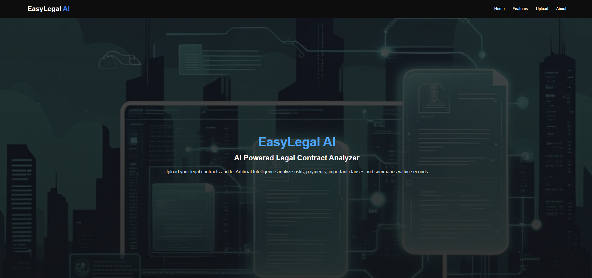
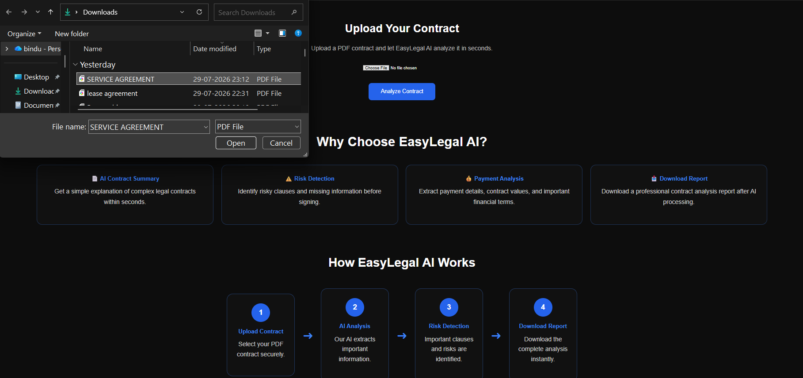
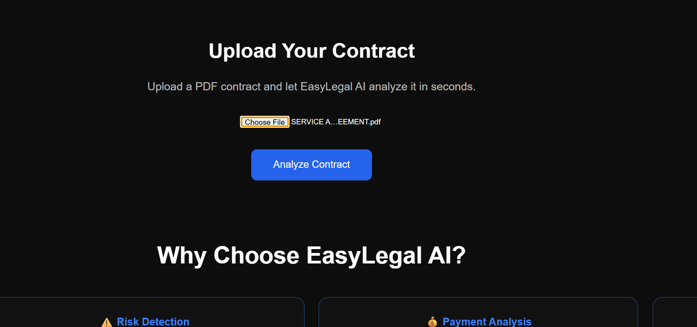
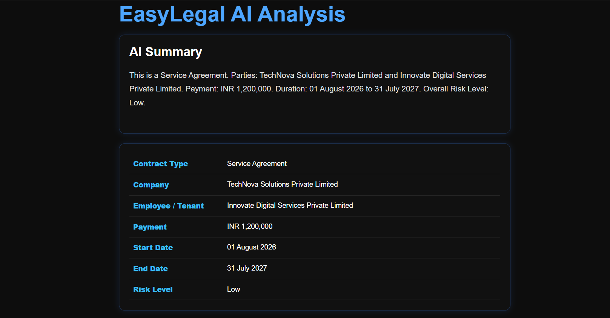
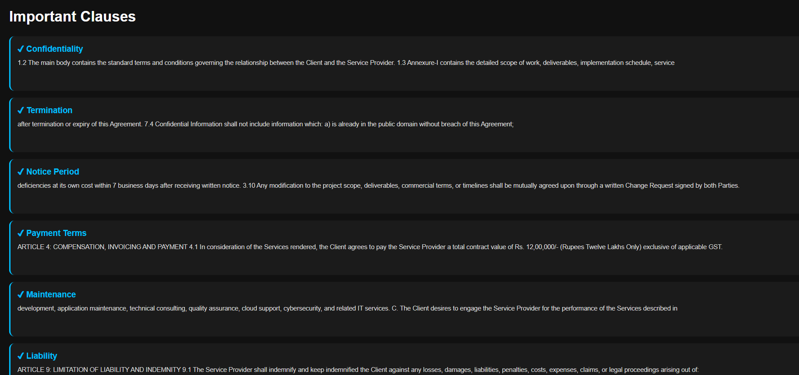
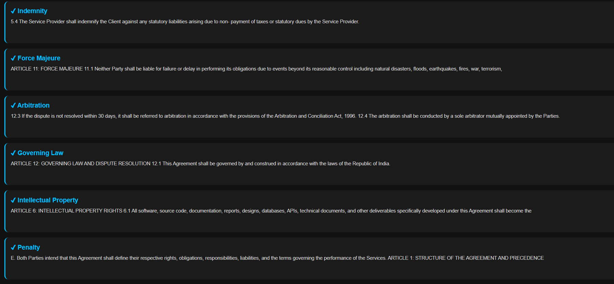
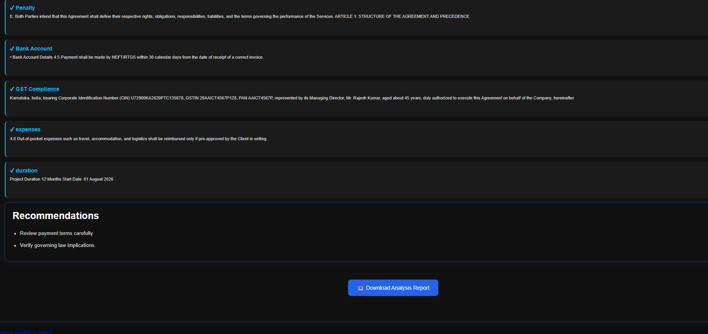

#   EasyLegal AI

EasyLegal AI is an AI-powered web application that helps users analyze legal contracts quickly and easily. Users can upload a PDF contract, and the application automatically extracts important information, identifies key legal clauses, assesses the contract's risk level, and generates a downloadable analysis report.

---

##  Live Demo

🔗 Live Website: https://easylegal-ai.onrender.com/

---

##  Features

- Upload legal contracts in PDF format
- Automatically identify the contract type
- Extract company/firm details
- Extract second party information
- Extract payment details
- Detect contract start and end dates
- Identify important legal clauses
- Analyze contract risk level (Low, Medium, High)
- Generate a detailed contract summary
- Provide recommendations based on the contract
- Download the complete analysis report

---

##  Technologies Used

- Python
- Flask
- HTML5
- CSS3
- JavaScript
- Regular Expressions (Regex)
- Git
- GitHub
- Render

---

##  Project Structure

```text
EasyLegal-AI/
│
├── app.py
├── requirements.txt
├── backend/
│   ├── ai_engine.py
│   └── pdf_reader.py
├── templates/
│   ├── index.html
│   └── result.html
├── static/
│   ├── style.css
│   ├── script.js
│   └── images/
├── uploads/
├── analysis_report.txt
└── README.md
```

---

##  How It Works

1. Upload a legal contract in PDF format.
2. The application extracts the contract text.
3. EasyLegal AI analyzes the document.
4. Important clauses are detected.
5. Key information such as payment, parties, and dates is extracted.
6. A risk level is calculated.
7. A complete analysis report is generated.
8. Users can download the report.

---

## 📸 Screenshots

### 🏠 Home Page


### 📤 Upload Contract


### 📄 Upload Success


### 📊 Analysis Result








---

##  Installation

Clone the repository

```bash
git clone https://github.com/bindu-s-dev/EasyLegal-AI
```

Go to the project folder

```bash
cd EasyLegal-AI
```

Install dependencies

```bash
pip install -r requirements.txt
```

Run the application

```bash
python app.py
```

---

## 🎯 Future Improvements

- AI-powered contract summarization
- Multiple language support
- User authentication
- Contract history
- DOCX report generation
- Dashboard with analytics
- Clause highlighting
- OCR support for scanned PDFs

---

## 👨‍💻 Author

**Bindu S**

BCA Student | Python Developer | AI Enthusiast

GitHub:
https://github.com/bindu-s-dev/

LinkedIn:
https://www.linkedin.com/in/bindu-s-44a909336

---

## ⭐ If you like this project

Please consider giving this repository a ⭐ on GitHub.

It motivates me to build more useful projects.

---

## 📄 License

This project is developed for educational and portfolio purposes.